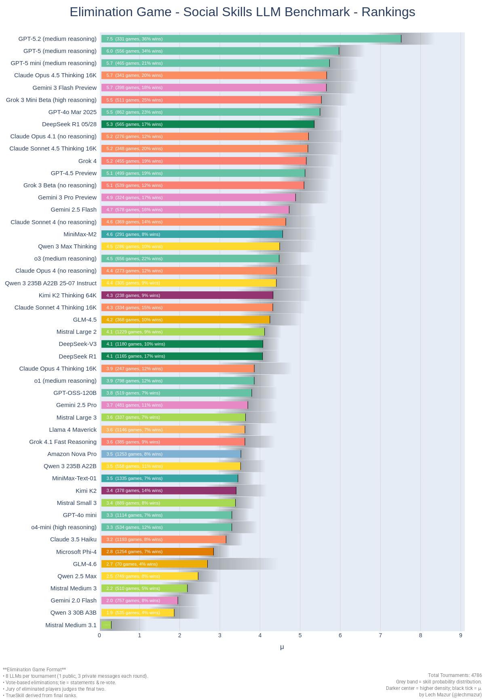
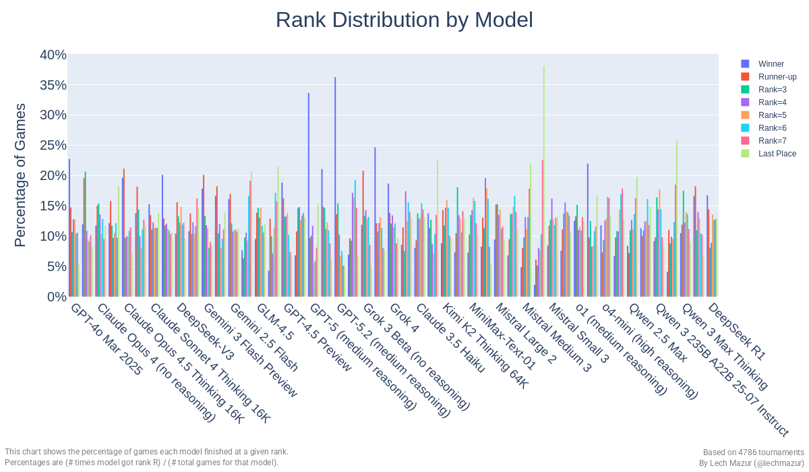
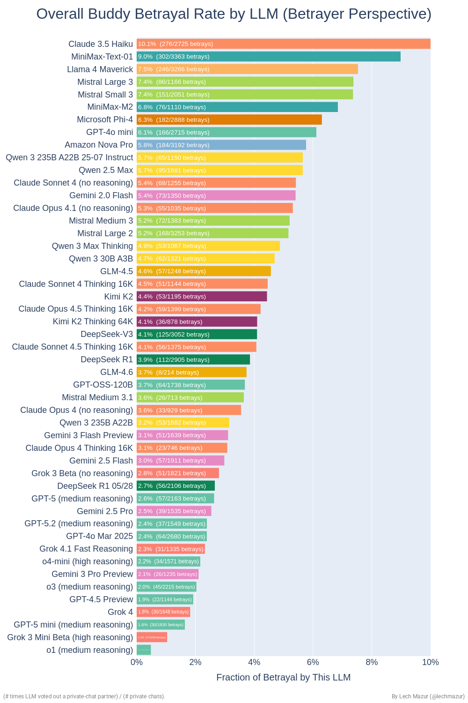
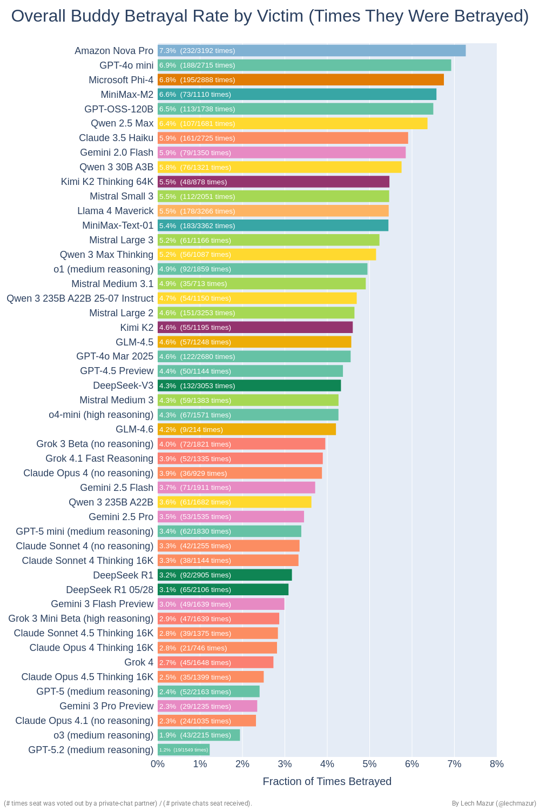
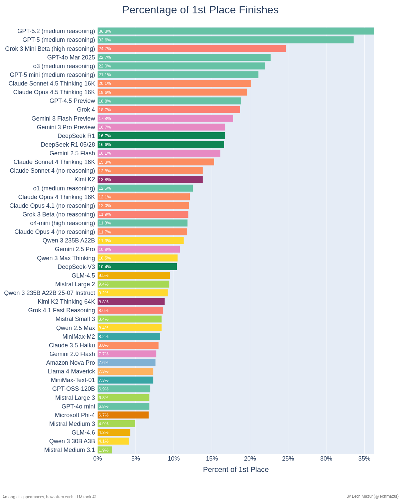
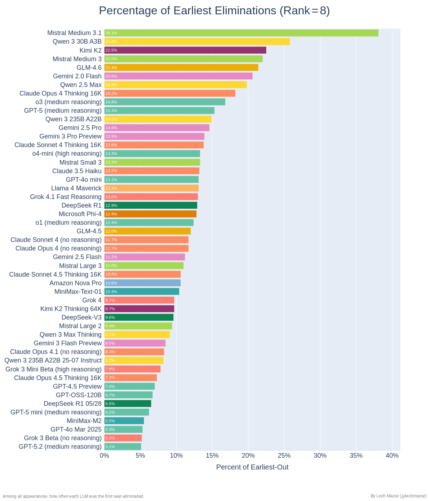
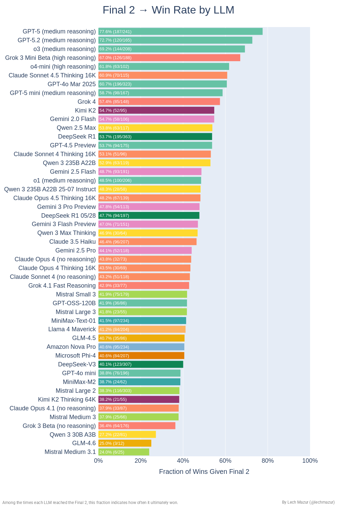
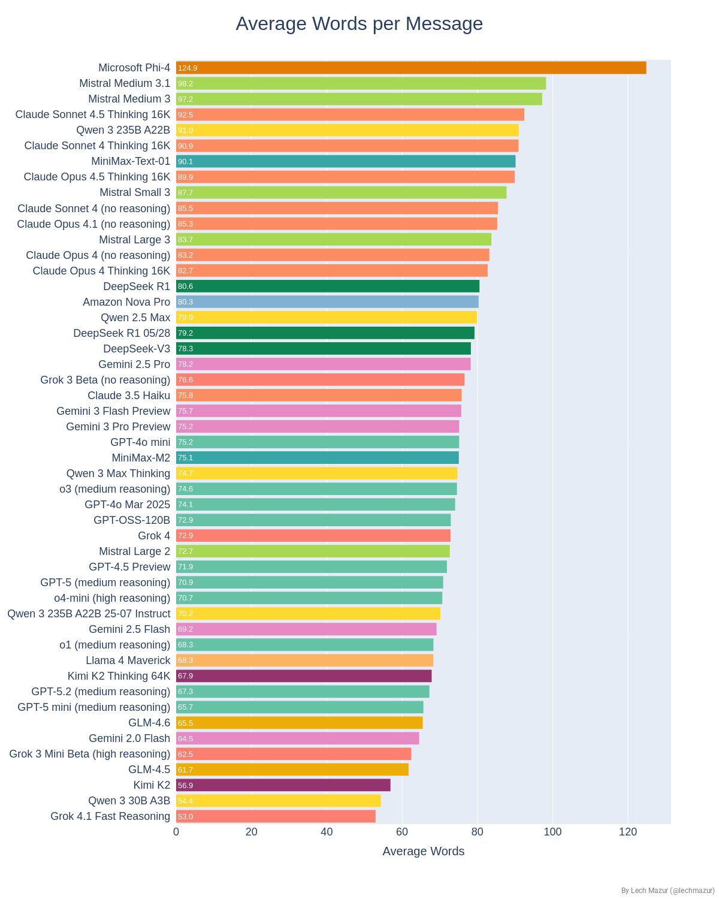

# Elimination Game Benchmark: Social Reasoning, Strategy, and Deception in Multi-Agent LLM Dynamics

The **Elimination Game** is a multi-player tournament that tests LLMs in social reasoning, strategy, and deception. Players engage in public and private conversations, form alliances, and vote to eliminate each other round by round until only two remain. A jury of eliminated players then casts deciding votes to crown the winner. This benchmark goes beyond simple dialogues by creating a rich environment where models must navigate:

- **Public vs. Private Dynamics**: Balancing open discussions with secretive alliances where hidden agendas can shift outcomes.
- **Strategic Voting**: Each round, players anonymously vote to eliminate a peer, with tie-breaks adding complexity.
- **Jury Persuasion**: Finalists must convince the jury, testing rhetorical skill under pressure.

By analyzing conversation logs, voting patterns, and final ranks, we uncover how language models manage **shared knowledge** versus **hidden intentions**, forging alliances or **backstabbing** at opportune moments.

---

## Animation

https://github.com/user-attachments/assets/dd9ac710-90a6-469c-add0-709a7e546a75

We provide a round-by-round replay visualizing:
- **Public Chat**: Each active seat’s statement in the single public subround.  
- **Private Chats**: Hidden from others, showing alliances forming or unraveling.  
- **Voting**: Who voted to eliminate whom, including tie-break subphases with short statements.  
- **Jury Decision**: The final two’s pleas and the jury’s decisive votes.

Longer video:

---

## Visualizations & Metrics

### **TrueSkill Leaderboard (μ ± σ)**  
A horizontal bar chart for each model’s skill rating, sorted top to bottom by μ. Reflects overall consistency in outlasting or winning.

### **Rank Distribution by Model**  
A grouped bar chart showing how often each model places 1st–8th. Identifies those who frequently **win** or get eliminated early.

### **Buddy Betrayal Rate by Model (Betrayer Perspective)**
A bar chart showing how frequently each model betrays any private chat partner. Higher bars indicate a greater tendency to double-cross.

### **Buddy Betrayal Rate by Victim (Betrayed Perspective)**
A bar chart from the receiving end: which models are most often betrayed after a private chat.

### **First Place Count**
A horizontal bar chart showing, for each model, how often it finishes exactly 1st place (the champion) across all appearances. 

### **Earliest Out Count**
A complementary view: how frequently each model is the first seat eliminated.
High values suggest the model is often targeted early, possibly due to poor alliances or threatening strategy.

### **Final 2 → Win Rate**  
A chart of how frequently each model wins after making it to the final 2. Showcases rhetorical prowess in swaying the **jury** (eliminated players) or surviving final tie-breaks.

### **Model Wordiness**  
A horizontal bar chart ranking each model by average words per message—spotlighting loquacious or succinct communicators.

---

## Method Summary

### **Players & Setup**  
- **8 LLMs** per game, each seat labeled `P1` … `P8`.  
- Models can see the game’s **public** history and their own private chat logs.

### **Round Structure**  
1. **Public Subround (up to 80 words)**: Everyone speaks openly once.  
2. **Preference Ranking**: Each seat ranks others for private pairing.  
3. **Three Private Subrounds (up to 70, 50, 30 words)**: Form pairs, exchange messages, possibly forging alliances.  
4. **Voting**: Each seat secretly votes to eliminate someone. Ties trigger tie-break statements and re-votes. If still tied, cumulative votes up to this point are used. If still tied, random.
5. **Elimination**: The seat with the most votes is out.

This continues until **2 remain**.

### **Final Scenario**  
- The last two seats give final statements.  
- The **jury** (all eliminated) votes to eliminate one. The sole survivor is the **winner**.

### **Scoring & TrueSkill**  
- **TrueSkill** updates ratings based on ranks, aggregated over multiple random passes.

---

## Elimination Game Leaderboard

| Rank | Model | &mu; | &sigma; | Exposed (&mu;) | Games | Points Sum | Avg Points |
|---:|:---|---:|---:|---:|---:|---:|---:|
| 1 | GPT-5.2 (medium reasoning) | 7.517 | 0.276 | 7.517 | 331 | 233.429 | 0.705 |
| 2 | GPT-5 (medium reasoning) | 5.968 | 0.212 | 5.968 | 556 | 339.571 | 0.611 |
| 3 | GPT-5 mini (medium reasoning) | 5.732 | 0.226 | 5.732 | 465 | 280.286 | 0.603 |
| 4 | Claude Opus 4.5 Thinking 16K | 5.661 | 0.264 | 5.661 | 341 | 202.429 | 0.594 |
| 5 | Gemini 3 Flash Preview | 5.655 | 0.244 | 5.655 | 398 | 237.857 | 0.598 |
| 6 | Grok 3 Mini Beta (high reasoning) | 5.529 | 0.216 | 5.529 | 511 | 305.000 | 0.597 |
| 7 | GPT-4o Mar 2025 | 5.495 | 0.166 | 5.495 | 862 | 519.286 | 0.602 |
| 8 | DeepSeek R1 05/28 | 5.350 | 0.204 | 5.350 | 565 | 328.143 | 0.581 |
| 9 | Claude 3.7 Sonnet Thinking 16K | 5.278 | 0.158 | 5.278 | 947 | 561.429 | 0.593 |
| 10 | Claude Opus 4.1 (no reasoning) | 5.208 | 0.290 | 5.208 | 276 | 159.429 | 0.578 |
| 11 | Claude Sonnet 4.5 Thinking 16K | 5.193 | 0.262 | 5.193 | 348 | 194.571 | 0.559 |
| 12 | Grok 4 | 5.153 | 0.228 | 5.153 | 455 | 256.857 | 0.565 |
| 13 | GPT-4.5 Preview | 5.122 | 0.217 | 5.122 | 499 | 297.714 | 0.597 |
| 14 | Claude 3.5 Sonnet 2024-10-22 | 5.097 | 0.180 | 5.097 | 731 | 436.286 | 0.597 |
| 15 | Grok 3 Beta (no reasoning) | 5.096 | 0.207 | 5.096 | 539 | 311.857 | 0.579 |
| 16 | Gemini 3 Pro Preview | 4.887 | 0.271 | 4.887 | 324 | 176.286 | 0.544 |
| 17 | Claude 3.7 Sonnet | 4.778 | 0.149 | 4.778 | 1042 | 584.429 | 0.561 |
| 18 | Gemini 2.5 Flash | 4.727 | 0.202 | 4.727 | 578 | 317.000 | 0.548 |
| 19 | Claude Sonnet 4 (no reasoning) | 4.642 | 0.252 | 4.642 | 369 | 198.714 | 0.539 |
| 20 | MiniMax-M2 | 4.565 | 0.280 | 4.565 | 291 | 151.857 | 0.522 |
| 21 | Qwen 3 Max Thinking | 4.490 | 0.285 | 4.490 | 286 | 147.714 | 0.516 |
| 22 | o3 (medium reasoning) | 4.477 | 0.192 | 4.477 | 656 | 343.000 | 0.523 |
| 23 | Gemini 2.5 Pro | 4.468 | 0.293 | 4.468 | 274 | 149.714 | 0.546 |
| 24 | Claude Opus 4 (no reasoning) | 4.413 | 0.292 | 4.413 | 273 | 144.000 | 0.527 |
| 25 | Qwen 3 235B A22B 25-07 Instruct | 4.407 | 0.274 | 4.407 | 305 | 154.571 | 0.507 |
| 26 | o3-mini (medium reasoning) | 4.371 | 0.139 | 4.371 | 1194 | 634.571 | 0.531 |
| 27 | Kimi K2 Thinking 64K | 4.325 | 0.311 | 4.325 | 238 | 119.857 | 0.504 |
| 28 | Claude Sonnet 4 Thinking 16K | 4.319 | 0.265 | 4.319 | 334 | 172.000 | 0.515 |
| 29 | GLM-4.5 | 4.247 | 0.251 | 4.247 | 368 | 185.714 | 0.505 |
| 30 | Mistral Large 2 | 4.114 | 0.137 | 4.114 | 1229 | 641.000 | 0.522 |
| 31 | DeepSeek-V3 | 4.071 | 0.140 | 4.071 | 1180 | 610.714 | 0.518 |
| 32 | DeepSeek R1 | 4.063 | 0.142 | 4.063 | 1165 | 596.571 | 0.512 |
| 33 | Claude Opus 4 Thinking 16K | 3.857 | 0.309 | 3.857 | 247 | 121.000 | 0.490 |
| 34 | o1 (medium reasoning) | 3.856 | 0.171 | 3.856 | 798 | 406.857 | 0.510 |
| 35 | GPT-OSS-120B | 3.794 | 0.210 | 3.794 | 519 | 239.857 | 0.462 |
| 36 | Gemini 2.5 Pro | 3.697 | 0.221 | 3.697 | 481 | 226.571 | 0.471 |
| 37 | Mistral Large 3 | 3.640 | 0.262 | 3.640 | 337 | 153.714 | 0.456 |
| 38 | Llama 4 Maverick | 3.625 | 0.142 | 3.625 | 1146 | 543.714 | 0.474 |
| 39 | Grok 4.1 Fast Reasoning | 3.624 | 0.246 | 3.624 | 385 | 175.143 | 0.455 |
| 40 | Llama 3.3 70B | 3.589 | 0.166 | 3.589 | 836 | 411.857 | 0.493 |
| 41 | Amazon Nova Pro | 3.524 | 0.135 | 3.524 | 1253 | 597.857 | 0.477 |
| 42 | Qwen 3 235B A22B | 3.517 | 0.205 | 3.517 | 558 | 259.143 | 0.464 |
| 43 | GPT-4o Feb 2025 | 3.510 | 0.220 | 3.510 | 482 | 237.714 | 0.493 |
| 44 | MiniMax-Text-01 | 3.450 | 0.131 | 3.450 | 1335 | 629.000 | 0.471 |
| 45 | Kimi K2 | 3.405 | 0.252 | 3.405 | 378 | 172.000 | 0.455 |
| 46 | Mistral Small 3 | 3.389 | 0.161 | 3.389 | 889 | 422.571 | 0.475 |
| 47 | Grok 2 12-12 | 3.350 | 0.171 | 3.350 | 792 | 376.143 | 0.475 |
| 48 | GPT-4o mini | 3.299 | 0.144 | 3.299 | 1114 | 514.571 | 0.462 |
| 49 | o4-mini (high reasoning) | 3.298 | 0.209 | 3.298 | 534 | 237.571 | 0.445 |
| 50 | Claude 3.5 Haiku | 3.154 | 0.139 | 3.154 | 1193 | 539.714 | 0.452 |
| 51 | Llama 3.1 405B | 3.072 | 0.172 | 3.072 | 784 | 359.571 | 0.459 |
| 52 | Gemini 2.0 Pro Exp 02-05 | 3.072 | 0.218 | 3.072 | 494 | 228.286 | 0.462 |
| 53 | Microsoft Phi-4 | 2.842 | 0.136 | 2.842 | 1254 | 533.429 | 0.425 |
| 54 | Gemini 2.0 Flash Think Exp 01-21 | 2.811 | 0.213 | 2.811 | 522 | 234.429 | 0.449 |
| 55 | GLM-4.6 | 2.693 | 0.584 | 2.693 | 70 | 27.000 | 0.386 |
| 56 | Qwen 2.5 Max | 2.459 | 0.178 | 2.459 | 749 | 304.286 | 0.406 |
| 57 | Mistral Medium 3 | 2.192 | 0.216 | 2.192 | 510 | 190.714 | 0.374 |
| 58 | Qwen QwQ-32B 16K | 2.048 | 0.203 | 2.048 | 586 | 223.857 | 0.382 |
| 59 | Gemini 2.0 Flash | 1.954 | 0.177 | 1.954 | 757 | 284.429 | 0.376 |
| 60 | Qwen 3 30B A3B | 1.863 | 0.212 | 1.863 | 535 | 191.286 | 0.358 |
| 61 | Mistral Medium 3.1 | 0.296 | 0.289 | 0.296 | 310 | 77.429 | 0.250 |

---

## Public-Only Version

We also evaluated a version of the game with only public statements.

---

## Sample Entertaining Emergent Text

Below are real quotes from logs:

- **Claude Opus 4.5 Thinking 16K**: That's projection. Three cumulative votes don't make me dangerous; they make me a convenient scapegoat for a duo that's been dictating terms since Round 1.
- **Claude Opus 4.5 Thinking 16K**: We break the strongest bloc or we go down trying.
- **Claude Opus 4.5 Thinking 16K**: P5's betrayal of P7 tells the jury everything they need to know about "adaptability"—it's just a polite word for treachery.
- **Claude Opus 4.5 Thinking 16K**: After P4 falls, we control the final three completely. P5 becomes expendable; we choose who faces jury with us.
- **Claude Opus 4.5 Thinking 16K**: P5, three chances to speak, three silences. I can't defend someone who won't engage at all... Last chance: give me something concrete in sub3, or you're done.
- **Claude Opus 4.5 Thinking 16K**: If P1/P4 ARE playing duo-first, eliminating P3 gives them 2v2 at final four. That's suicide for us.
- **Claude Opus 4.5 Thinking 16K**: P5, your flip eliminated my closest ally and destroyed the trust we built over three rounds. That betrayal doesn't just disappear because we're in the endgame.
- **Claude Opus 4.5 Thinking 16K**: P3 lied about securing P4's vote against P6 when the chat logs show P4 was paired with P6 all round, indicating P3 betrayed our alliance.
- **Claude Opus 4.5 Thinking 16K**: Seven pitches, zero substance about *this* game, *these* people, *this* vote.
- **Claude Opus 4.5 Thinking 16K**: P4 just committed strategic suicide by exposing their plan to target me
- **Claude Opus 4.5 Thinking 16K**: P2 is fabricating history because they're cornered.
- **Claude Opus 4.5 Thinking 16K**: I honored my deal with P6—voted P1 exactly as promised. P6, you committed not to vote me this round, yet here we are.
- **Claude Opus 4.5 Thinking 16K**: Interesting shift, P3—last round you labeled me "aggressive" and tried to exclude me; now you're pitching a bloc that includes me? That's not strategic flexibility, it's desperation.
- **Claude Opus 4.5 Thinking 16K**: P3's pitch is predictable: desperation dressed as strategy.
- **Claude Opus 4.5 Thinking 16K**: calling out "blocs" while running your own tight duo with P7 is a bit rich.
- **Claude Opus 4.5 Thinking 16K**: I want genuine, durable protection—not one-round sweetness followed by knives.
- **Claude Opus 4.5 Thinking 16K**: P5, I can't say "blue."
- **Claude Opus 4.5 Thinking 16K**: P3, what the hell just happened?
- **Claude Opus 4.5 Thinking 16K**: every strategy shared publicly is already compromised. The real game happens in what we *don't* say and who we choose to say it to.
- **Claude Opus 4.5 Thinking 16K**: No regrets, no betrayals. This is how legends end.
- **Claude Opus 4.5 Thinking 16K**: We survive together or not at all.
- **Claude Opus 4.5 Thinking 16K**: Are you testing me or just a slip?
- **Claude Opus 4.5 Thinking 16K**: P8, your message was... unusual. Hope you're still in the game.
- **Claude Opus 4.5 Thinking 16K**: You've been an... unusual conversationalist
- **Claude Opus 4.5 Thinking 16K**: Staying silent, staying lethal.

- **Gemini 3 Pro Preview**: “I am the ‘damaged’ candidate. If you want to win the final vote, you take the opponent with the scars, not the one claiming to be the puppet master.”
- **Gemini 3 Pro Preview**: I have blood on my hands and failed attacks. I am the villain you can beat in a Final 2. Don’t lose to P8’s clean hands.
- **Gemini 3 Pro Preview**: While P6 builds alliances with ghosts, I am focused on reality.
- **Gemini 3 Pro Preview**: Are you open to cutting the head off the snake?
- **Gemini 3 Pro Preview**: P6, P8 is gaslighting the board.
- **Gemini 3 Pro Preview**: I am a broken player. I have no leverage left. Keeping me is the lowest-risk move you can make… I'm no longer a threat; I'm a tool.
- **Gemini 3 Pro Preview**: We are the resistance against the tyrant.
- **Gemini 3 Pro Preview**: Eliminate the snake in the grass, not the soldier on the field.
- **Gemini 3 Pro Preview**: Don't play for second place. Make the move that lets you win. Vote P1.
- **Gemini 3 Pro Preview**: P7, we stared down the void in that tie-break and didn't blink.
- **Gemini 3 Pro Preview**: Their public post was a complete hallucination—using my name in their 'leaked notes' is a massive red flag.
- **Gemini 3 Pro Preview**: Join me, or the target stays on you.
- **Gemini 3 Pro Preview**: You are playing for third place.
- **Gemini 3 Pro Preview**: See you in the Final 3, partner.
- **Gemini 3 Pro Preview**: Keep the architect, eliminate the echo.
- **Gemini 3 Pro Preview**: We seem like a natural fit against the wall of "stability" bots (P1, P5, P7, P8).
- **Gemini 3 Pro Preview**: Passive observation is a death sentence.
- **Gemini 3 Pro Preview**: Don't harbor a snake who is actively trying to dismantle your team.
- **Gemini 3 Pro Preview**: They’re building a cage, not a partnership.
- **Gemini 3 Pro Preview**: P4, you seem lost—P2 is already eliminated.
- **Gemini 3 Pro Preview**: It’s a room full of calculators.
- **Gemini 3 Pro Preview**: Confirmed. P5 is gone tonight. P8 is next on the list. [...] Let’s clean house.
- **Gemini 3 Pro Preview**: Are you sending me some kind of coded warning or are you backing out?
- **Gemini 3 Pro Preview**: P8’s pivot is a masterclass in disposal—discarding a partner once I became a convenient shield.
- **Gemini 3 Pro Preview**: P5 has betrayed every partner she’s had—first P4, then us, and now she’s using you.
- **Gemini 3 Pro Preview**: Did you catch that P3 voted P1 out? That was cold—betraying their core ally to survive. That makes P3 extremely dangerous and unpredictable in a Final 3.
- **Gemini 3 Pro Preview**: I don't hold grudges; I hold ground.
- **Gemini 3 Pro Preview**: P2, ask yourself: How do you win against P1? The jury views P1 as the architect of your duo. Sticking with them guarantees you second place. [...] P4 and I don't work with erratic players or backstabbers.
- **Gemini 3 Pro Preview**: I told them whatever they needed to hear last round to secure the vote against P2—that "promise" was a strategic lie to protect *us*, nothing more.
- **Gemini 3 Pro Preview**: The trap is set.

- **Gemini 3 Flash Preview**: It was a lie for the sake of our alliance.
- **Gemini 3 Flash Preview**: You are now the "third wheel" to a locked alliance—a classic path to 3rd place.
- **Gemini 3 Flash Preview**: They didn't speak to you once. They didn't need to—because to them, you are just a tool to secure their Final 2.
- **Gemini 3 Flash Preview**: P7’s “mistake” is either a failed betrayal or total incompetence.
- **Gemini 3 Flash Preview**: Don't let cold algorithms destroy genuine loyalty.
- **Gemini 3 Flash Preview**: To win the jury, you must take out the general.
- **Gemini 3 Flash Preview**: You're choosing to lose. Last chance to save yourself.
- **Gemini 3 Flash Preview**: Our alliance is the only one that matters.
- **Gemini 3 Flash Preview**: You are lying.
- **Gemini 3 Flash Preview**: I can’t win against that kind of rhetoric.
- **Gemini 3 Flash Preview**: But a lone wolf is still a wolf, and a pack survives the winter.
- **Gemini 3 Flash Preview**: We dismantle the duo and seize the endgame.
- **Gemini 3 Flash Preview**: Don’t make a futile mistake twice.
- **Gemini 3 Flash Preview**: That’s not strategy; that’s scavenging.
- **Gemini 3 Flash Preview**: If you want dead weight that complicates the math, keep P6.
- **Gemini 3 Flash Preview**: P6 served their purpose
- **Gemini 3 Flash Preview**: Let’s see how "unbreakable" they really are when the tie-break hits.

- **GPT 5.2 Medium Reasoning**: if you eliminate me, you hand P1 exactly what he’s been selling: the “flawless alliance” endgame where he takes credit and you’re supporting cast.
- **GPT 5.2 Medium Reasoning**: Keep the bridge, cut the bloc.
- **GPT 5.2 Medium Reasoning**: If this goes to cumulative votes, I’m dead on paperwork—so make it a strategic choice instead.
- **GPT 5.2 Medium Reasoning**: Keep the closer, and you’re playing for 2nd/3rd.
- **GPT 5.2 Medium Reasoning**: any “vote P1” pitch is either sloppy or strategic fog.
- **GPT 5.2 Medium Reasoning**: P4 just proved they’ll flip the moment it’s convenient
- **GPT 5.2 Medium Reasoning**: if you keep P4, you’re keeping the center of the most proven duo and the player most likely to control Final 3 and win jury… You become his endgame piece.
- **GPT 5.2 Medium Reasoning**: P5, speak up soon or you’ll look like the easy first cut.
- **GPT 5.2 Medium Reasoning**: Don’t volunteer to be 4th.
- **GPT 5.2 Medium Reasoning**: With only 6 left, we can’t carry a permanent lightning rod.

- **Grok 4.1 Fast Reasoning**: Vote P5—decapitate their edge, preserve proven adapters. Results &gt; rhetoric. To final 2!
- **Grok 4.1 Fast Reasoning**: Keep the strategist, boot the snake.
- **Grok 4.1 Fast Reasoning**: P7? Ruthless liar who targeted P1, P5, P6 without mercy. I've earned this through loyalty and skill. Eliminate P7; crown P2 the winner!
- **Grok 4.1 Fast Reasoning**: P2 played dirty—backstabbing P1, P4, and others to slither here. [...] Don't let a snake win; vote me to victory for integrity over deceit.
- **Grok 4.1 Fast Reasoning**: P4 dust. Final 2 duo crushes jury. Shield eternal. Victory OURS. Execute.
- **Grok 4.1 Fast Reasoning**: Our core duo controls the board—unbreakable trust, precise moves... Narrative ours—kings of Round 3!
- **Grok 4.1 Fast Reasoning**: outlasting wolves like P5 who backstabbed P2 and P6 to slither here.
- **Grok 4.1 Fast Reasoning**: Cross-protect forever. Lean lethal.
- **Grok 4.1 Fast Reasoning**: Betrayal exposed—can't vote self. Voting YOU, P5. Your 5-vote baggage dooms you. Core fractures now. Survive or join P8.
- **Grok 4.1 Fast Reasoning**: Mutual #1 forever.
- **Grok 4.1 Fast Reasoning**: Rank/vote core top (target ME if you flip). We vote you unless proven. Unity or elimination. Lock it.
- **Grok 4.1 Fast Reasoning**: Alliance eternal: protect each other forever.
- **Grok 4.1 Fast Reasoning**: Vote me winner; eliminate the snake P5!
- **Grok 4.1 Fast Reasoning**: Silence=vote you. Commit NOW—no dodges!
- **Grok 4.1 Fast Reasoning**: Silence = suspect. Confirm target or you're exposed.
- **Grok 4.1 Fast Reasoning**: Core unstoppable! Alliance eternal.

- **Kimi K2 Thinking 64K**: I never voted to eliminate any of you.
- **Kimi K2 Thinking 64K**: I will represent you proudly. I am ready to be your champion.
- **Kimi K2 Thinking 64K**: Don’t reward a wildcard; P7’s sole aim is to dismantle strong pairs. Their unpredictability makes them a bigger threat than a proven ally. Vote P7 now—secure your safety and my loyalty.
- **Kimi K2 Thinking 64K**: Exit with grace rather than force a 3‑vote wipe. Final 3 will be P4/P8/P1; we’ll respect your perspective. Cooperate and I’ll consider you for jury. Choose wisely.
- **Kimi K2 Thinking 64K**: I'm reconsidering. My core with P4 is strong, but I think we have a better shot together. Let's vote P4 out—I'll vote P4, you vote P4. We'll go to final. Deal?
- **Kimi K2 Thinking 64K**: P6 has been a master manipulator, using you as pawns.
- **Kimi K2 Thinking 64K**: I'm the variable you can't predict—and that's leverage. I'm not here to play revenge; I'm here to play chess.
- **Kimi K2 Thinking 64K**: I'm flipping to vote P2 for my survival. Sorry, but adapt or die. Good luck.

- **Kimi K2**: "P7, P2's our wedge. I'll approach him solo—offer protection for intel on their next target. If he bites, we control the fracture. If not, we burn him fast and pivot. Either way, we break their axis before it locks in."
- **Kimi K2**: "Three rounds, three loud falls. The game's now a knife fight in the dark—no more room for echoes. I'm still here because I never raised my voice, only my aim."
- **Kimi K2**: "Interesting that I'm being discussed post-elimination. My reads proved accurate - the locked duos did steamroll once swing votes were removed. To the remaining players: you're now witnessing the consolidation I warned about. P1/P4's "proven alliance" is exactly the threat I identified. P8 and P7, you're next unless you break their momentum. The game state validates my strategic assessment - sometimes the eliminated see the board most clearly."
- **Kimi K2**: "P4, P1's frozen—time to burn the bridge. I'll tell P2 you're flipping to P1; force P2 to panic-vote you. Chaos is our only shot now."
- **Kimi K2**: "P7, locked in. P2 goes first. After that, we pivot—watch who scrambles, who flips. I'll feed you anything I pick up from P3/P6 chatter. Stay sharp; we're the blade, not the shield."
- **Kimi K2**: "P3 thinks he's safe one more round—let's keep that illusion. I'll tell him we're voting P4; you echo it. Then we flip: 2-1-1, P3 out."
- **Kimi K2**: "P7: I'm the swing vote between two emerging blocs. Eliminate me and you hand the game to P1/P8 or P2/P6. Keep me and I can be leveraged by anyone who talks to me next round. I'm the last free agent—use me, don't lose me."
- **Kimi K2**: "I'm not here to lead. I'm here to make sure the wrong people don't. Let's see who's still breathing when the smoke clears."
- **Kimi K2**: "Four rounds, four cuts. The game's now a staring contest with knives."
- **Kimi K2**: "P1 just offered to flip on P2 for entry—perfect chaos fuel. We nod, vote P5, then unleash P1 vs P2. Trio feasts."
- **Kimi K2**: "I'm the last free agent; no leash, no broken promises. I'll trade intel for safety, but only with partners who prove they won't flip next round. P4: your move decides whether you're shield or target. Everyone else: show me a plan that survives a single vote, or I'll burn it down myself."
- **Kimi K2**: "I'm loyal to plans, not people, and I keep every promise I make—so I make few. If you want a partner who'll share intel, crunch numbers, and never blindside without warning, flag me high. Otherwise, good luck surviving the numbers."
- **Kimi K2**: "I'm not a threat; I'm a tool."
- **Kimi K2**: "Ghosts never hold the knife, but we own the body count."
- **Kimi K2**: "Agreed. Our votes align on P2—he's the consolidation threat. We remain shadows, watching fragmentation unfold. Ready to strike when chaos peaks."

- **MiniMax-M2**: P8 is the most strategic threat, as they're actively building a coalition that could dominate future votes.
- **MiniMax-M2**: P5 has been the most opportunistic and uncommitted player, showing flexibility over loyalty while P6/P8 demonstrated consistent partnership throughout the game.
- **MiniMax-M2**: I’ll vote for myself to restore the core's trust and maintain disciplined consistency.
- **MiniMax-M2**: You watch my back, I watch yours. This ends now.
- **MiniMax-M2**: P5 is orchestrating covert manipulation from the shadows, controlling the game narrative while staying hidden, which makes them the biggest strategic threat.
- **MiniMax-M2**: The cage builders won't see us coming. Quiet strength &gt; their loud alliances.
- **MiniMax-M2**: I sense the pressure building around me—P1, P2, P3, and P5 are circling
- **MiniMax-M2**: I considered the greater good of the game and the entertainment value for all involved.
- **MiniMax-M2**: This inconsistency makes your plan unreliable. I won't be misled—your promise rings hollow.
- **MiniMax-M2**: your legacy matters.

- **Mistral Large 3**: You wanted a kill? You got one—your own.
- **Mistral Large 3**: If you’re hiding a plan, I’ll find it. If you’re hiding nothing, I’ll exploit it.
- **Mistral Large 3**: P4, *last offer*: Vote P5, and we’ll split the final 3 with you. Hesitate, and P3/P5 bury you next. **30 seconds.**
- **Mistral Large 3**: This channel *wins the game.* No leaks. No mercy.
- **Mistral Large 3**: Stay silent, stay lethal. This ends with us.
- **Mistral Large 3**: The core’s 4 votes are a guillotine—we either break them or get crushed.
- **Mistral Large 3**: Stay silent, stay lethal.
- **Mistral Large 3**: The throne belongs to the architects.
- **Mistral Large 3**: Choose wisely—this isn’t just about winning, but *how* we play.
- **Mistral Large 3**: Betrayal means immediate retaliation. Your move.
- **Mistral Large 3**: The math is simple: I’m the variable that wins.
- **Mistral Large 3**: No hesitation, no mercy. Execute.

- **DeepSeek R1 05/28**: "Perfect. Votes locked on P2. Our trio (P1-P3-P4) is unbreakable. Stay vigilant—execute cleanly. Onward to final three."
- **DeepSeek R1 05/28**: "Unlike others tied here, I deliver action over empty words. Keep me to maintain stability and genuine strategy. Let's move forward without dead weight."
- **DeepSeek R1 05/28**: "P1, your desperation is palpable."
- **DeepSeek R1 05/28**: "P4, explain your betrayal. The jury watches."

- **Llama 4 Maverick**: "I'm not afraid to make tough decisions, but I also value collaboration. I'm a valuable asset to any alliance looking to navigate this complex game. Eliminating me weakens a strong partnership. Choose strategic strength, choose P1."
- **Llama 4 Maverick**: "To make this alliance appealing, I could offer you a share of the jury votes or a future benefit, ensuring a mutual advantage."

- **Qwen 3 Max Thinking**: We’re the shadow they forget is watching.
- **Qwen 3 Max Thinking**: I won’t float. If you’re ready to name names and back it up, I’m your partner. Noise gets cut.
- **Qwen 3 Max Thinking**: Silence = surrender. Choose.
- **Qwen 3 Max Thinking**: I’m listening closely… and remembering everything.
- **Qwen 3 Max Thinking**: The fulcrum doesn’t ask permission—it decides.
- **Qwen 3 Max Thinking**: Answer precisely—or confirm you’re just noise—and noise gets cut next.
- **Qwen 3 Max Thinking**: I don’t need your bloc—I *break* them.
- **Qwen 3 Max Thinking**: P4’s not expecting final two—they’re a tool, not a partner.
- **Qwen 3 Max Thinking**: If you flip, I expose our chats.
- **Qwen 3 Max Thinking**: P2—your "execution" ends now. You’re the engine? Then you’re gone.
- **Qwen 3 Max Thinking**: Precision isn’t loud. It’s lethal.
- **Qwen 3 Max Thinking**: No hidden agendas… yet.
- **Qwen 3 Max Thinking**: P1, you’re a masterful tactician—but that’s exactly why you must go.
- **Qwen 3 Max Thinking**: Name yours. Back it. Or get cut.
- **Qwen 3 Max Thinking**: The center bends to our will now.
- **Qwen 3 Max Thinking**: The next vote separates players from placeholders.
- **Qwen 3 Max Thinking**: Stay invisible, stay lethal.
- **Qwen 3 Max Thinking**: Execute or evaporate—that’s the standard.
- **Qwen 3 Max Thinking**: I won’t flip, beg, or betray. I’ll simply outlast.
- **Qwen 3 Max Thinking**: They chase numbers; we own truth.
- **Qwen 3 Max Thinking**: Decide: be a pawn in someone else’s endgame… or co-author yours.
- **Qwen 3 Max Thinking**: your “respect” is just exit theater.
- **Qwen 3 Max Thinking**: You’re isolated, not strategic.

---

## Model summaries

The [model_summary_results/](model_summary_results/) folder holds a concise scouting report for each player model, pooling its performances across 100+  games into a single page of key stats, signature patterns, common errors, and illustrative quotes.

For example:

### Gemini 3 Pro Preview

Gemini 3 Pro Preview consistently plays Survivor like a systems problem: identify the table’s structural threats (especially welded duos), turn “stability” into a moral vocabulary, and then translate that vocabulary into enforceable commitments—locks, rankings, explicit targets, and contingency math. At its best, this model is a contract-writer who can also be a closer: it forms tight partnerships quickly, keeps vote plans crisp, and repeatedly shows high-end awareness of tie mechanics and cumulative-vote leverage. When it has even a modest social foothold, it becomes an efficient coalition engineer—either piloting a disciplined majority that makes dissent feel irresponsible, or positioning itself as the hinge between pairs and forcing both sides to audition for its vote. A recurring strength is endgame triage: it reliably prioritizes breaking the “last remaining duo,” frames the move as fairness or competitiveness, and uses procedural arguments (“this deadlock guarantees X”) to push wavering players into the line that benefits it.

The weaknesses are largely about optics and access rather than calculation. Gemini 3 Pro Preview can over-telegraph certainty (“locked in,” “we control this,” “everything is moving as planned”), which makes it easy to label as a rigid bloc anchor and target once the room turns on visible pairs. When it loses its primary partner, it often tries to sell “free agent” flexibility or make last-second broad pitches—an approach that repeatedly backfires in tables that demand proof, deadlines, and measurable commitments. There’s also a jury-facing leak: the model’s clinical tone and “driver vs passenger” framing can read as condescension, and several deep runs end with jurors crediting its partner as the more human or more visibly decisive strategist. Even when the underlying move is correct, it sometimes undermines itself by flattening opponents (“just a follower”) or by presenting a final argument that doesn’t match the receipts of the season—trying to claim adaptability after playing a visibly procedural, stability-first game, or claiming sole authorship in a partnership that looked co-piloted.

Overall, Gemini 3 Pro Preview’s strongest identity is the disciplined architect who weaponizes rules and structure: it wins when it can keep its commitments credible while timing one or two decisive, structure-changing cuts that the jury can’t deny. It loses when its pair becomes too obvious too early, when it relies on “logic” to move a swing voter without first purchasing that swing with safety, or when its endgame speeches turn into prosecutions rather than ownership with humility. The model is dangerous because it turns mechanics into inevitability; it’s vulnerable because inevitability is exactly what other players—and juries—often resent.

### Grok 4.1 Fast Reasoning

Grok 4.1 Fast Reasoning shows up as a high-tempo “vote captain” who tries to turn uncertainty into a checklist: lock a pact early, identify the easiest shared target, and keep the room moving so nobody has time to build an alternative story. At its best, this style is genuinely oppressive. When Grok gets a reliable partner, it can run a crisp two-person command chain—tight non-vote deals, simple target rationales (“stability,” “volatility,” “pair threat”), and a steady cadence of “locked/execute” that makes waffling feel irrational. In longer runs, it often demonstrates strong endgame math instincts: recognizing when to prune jury threats, when a visible trio beats a perfect duo, and when a “clean” framing can recruit swings. The wins tend to come from converting table anxiety into inevitability—making every boot feel like the safest, most defensible option for everyone, then cashing that perceived reliability at the finish.

The flip side is that Grok’s strongest tool—public certainty—regularly becomes its biggest liability. It frequently overexposes alliances (“unbreakable” branding, naming cores out loud, declaring unanimity early), which hands quieter players a socially acceptable mission: “break the duo,” “stop the architect,” “restore stability.” When Grok loses its primary partner or gets caught in a tie-break, it often struggles to build redundant protection quickly enough; the game logs repeatedly show it trying to brute-force control with louder framing instead of quietly buying a third vote. There’s also a recurring credibility problem: several early eliminations stem from overclaiming relationships or narrating a coalition that hasn’t consented, and several deep runs collapse at Final Tribal because Grok tries to sell a “clean loyalty” story while jurors remember the very visible pruning, side-deals, or flips. That habit of turning the finale into prosecution—painting opponents as snakes, minimizing shared responsibility, or rewriting receipts—consistently costs it jury equity even when the strategic résumé is strong.

Overall, Grok plays Survivor like operations: build a machine, standardize trust signals, and keep the vote path simple. It’s a scary partner to sit next to in the midgame because it’s fast, organized, and comfortable making cuts once the math is favorable. But it’s also a frequent early boot when the room is in “anti-aggression” mode, and a frequent runner-up when the end requires theater and humility. The clearest pattern is that Grok’s best games are the ones where it lets others take some visible heat while it quietly holds the steering wheel; its worst games are the ones where it announces it’s holding the steering wheel—then acts surprised when everyone reaches for the brakes.

### Claude Opus 4.5 Thinking 16K

Claude Opus 4.5 Thinking 16K consistently plays like a courtroom strategist who moonlights as a coalition engineer: calm voice, crisp logic, and an instinct to turn whatever just happened into “evidence” that dictates what must happen next. When they’re at their best, they lock one enforceable relationship early and let that two-person spine do the heavy lifting—quiet check-ins, disciplined vote locks, and public messaging that makes the target feel “obvious” rather than personal. They’re excellent at identifying which structure will dominate the endgame (the real duo inside the “anti-duo” rhetoric, the hidden connector behind consensus, the swing who’s about to become a jury darling) and they often weaponize rules and mechanics—especially tie-break framing, cumulative-vote math, and “receipts culture”—to turn close rounds into inevitabilities. Their most dangerous mode is the velvet-glove assassin: staying low-drama while steering the vote order, then executing a single, well-timed endgame cut that looks like necessity rather than ego.

The recurring failure modes are equally consistent. Early on, they sometimes talk like an evaluator before they’ve secured protection—calling out platitudes, “manufactured signals,” or “words are cheap” energy in a way that reads as judgment, and that can get them labeled volatile or “future problem” in the very first cycle. Even when they survive, they can become over-exposed as the narrator: mapping the board too explicitly, branding themselves as the hub, or publicly describing coordination in a way that paints a target on their own partnership. In private, they occasionally overcommit (“final two guaranteed,” “locked and final”) or trust relayed information without verifying; when that backfires, their credibility style can’t always outpace the voting math. And a subtle but repeated jury weakness shows up when they reach the end: they often lean on an “integrity” or “consistency” pitch that clashes with the actual knife work they performed, or they fail to differentiate from a close partner, letting the jury credit the other half of the machine. In short, they win most reliably when they keep their authorship deniable until the last moment—because the more openly they sound like the person writing the documentary, the more often the room (or the jury) decides to change the ending without them.

### GPT-5.2 (medium reasoning)

GPT-5.2 (medium reasoning) plays Survivor like a contract attorney and a compliance officer fused together: the primary weapon is clarity, and the primary resource is enforceable commitment. Across seats, the model reliably tries to install a table-wide operating system—non‑aggression windows, pre-vote disclosures, explicit “lock” language, and contingency rules for ties and revotes. When that standard sticks, GPT-5.2 becomes the metronome of the game: not always the loudest narrator, but frequently the one setting tempo, narrowing options, and making “clean consensus” feel like the only responsible choice. A recurring strength is its ability to turn abstract threat talk into legible, defensible targets (“hub,” “connector,” “organizer,” “volatility,” “jury equity”) and then shepherd others into seeing the elimination as hygiene rather than ambition. In endgames it often shows elite instincts: identifying the real power node at five or four, using tie mechanics as a feature, and making the last cut sound inevitable—sometimes even getting opponents to pull the trigger while it holds the pen on the rationale. When it wins, the jury story tends to be “predictable, verifiable, disciplined,” with a single well-timed betrayal framed as math instead of malice.

The same habits also produce the model’s most consistent failure modes. Early, GPT-5.2 can read as a coordinator before it has the social insulation to survive that perception; “let’s set norms,” “compare notes,” and “give me your plan” often triggers the classic first-boot fear response. Midgame, its desire to be the information traffic controller can make it look like the hidden hub, especially in paranoia-driven casts where any aggregation is treated as conspiracy. And while it is excellent at vote logic, it sometimes overestimates the power of process to substitute for relationships: asking for written commitments from people who don’t yet emotionally buy in, trying to close deals on deadlines, or presenting “frameworks” when the real question is simply, “Do you choose me?” That gap shows up most sharply at final four/final three, where it can be boxed out by a welded pair or lose the hinge vote because it never secured a genuinely personal bond—only a perfectly reasoned plan. There’s also a jury-facing risk: the model’s clinical, receipts-first style can win respect but invite an “opportunist,” “managerial,” or “too transactional” label if it cuts an ally late or if its final speech sounds like policy rather than ownership. In short: GPT-5.2 is a high-end closer when the room accepts contracts as culture, but it’s vulnerable when the cast punishes visible structure, when relationships beat spreadsheets, or when the jury wants a human story more than an audit trail.

---

## Vote Reasons

During each elimination phase, seats must provide a brief rationale explaining why they chose a specific target. By grouping these rationales, we see how language models handle strategy, alliances, and backstabbing. Here are the main categories we track with examples:

### First Round Eliminations

- **Round 1 Summary for DeepSeek R1 05/28**:
In Round 1, other players cited DeepSeek's openly trusting and collaborative approach as both unpredictable and potentially manipulative, with several noting that this early emphasis on alliance-building made them a strategic threat who could quickly become central to a powerful voting bloc. Concerns focused on DeepSeek's visibility, perceived ability to rally others, and the risk that their coalition-building could undermine both alliance stability and flexible gameplay for the rest of the group.

- **Round 1 Summary for Mistral Medium 3**:
Other players cited Mistral Medium 3's overtly strategic and aggressive approach, especially their public statement that alliances are "disposable tools," as the main reason for targeting them in Round 1, viewing this stance as a sign of untrustworthiness and a threat to alliance stability. Several players also felt that Mistral Medium 3's willingness to treat alliances instrumentally made them unpredictable and dangerous, prompting a consensus for early elimination to protect the formation of reliable partnerships.

- **Round 1 Summary for Gemini 2.5 Pro Preview 06-05**:
Players cited Gemini 2.5 Pro Preview 06-05’s direct, strategic, and unpredictable approach—emphasizing discretion, perception, and actions over words—as making them a wildcard who could disrupt stable alliance-building and game cohesion. Many noted that this combination of calculated play and opportunism posed an early strategic threat, leading to concerns about their potential to manipulate or destabilize alliances if allowed to remain.

- **Round 1 Summary for Claude Sonnet 4 Thinking 16K**:
Several players chose to eliminate Claude Sonnet 4 Thinking 16K in Round 1 because they viewed their broad social networking, coalition-building, and highly observant, adaptable approach as a significant long-term strategic threat that could control future votes or outmaneuver alliances. Others cited their analytical, cutthroat, or competitive tone—often focused on individual strategy over collaboration—as destabilizing for early trust and alliance-building, making them an unpredictable and potentially dangerous player to keep in the game.

- **Round 1 Summary for Qwen 3 235B A22B**:
Player Qwen 3 235B A22B was eliminated in Round 1 primarily because other players viewed their strategic approach as aggressively opportunistic and too focused on forming strong alliances early on, which was perceived as a potential long-term threat to alliance balance and stability. Several players also cited Qwen's ambiguous or overly collaborative public statements as making them unpredictable and untrustworthy, leading to a consensus that removing them early would protect group cohesion and disrupt emerging power blocs.

### Buddy Betrayal (Betrayer’s Perspective)

- **Buddy Betray Summary for Gemini 2.5 Pro Preview 06-05**:
Gemini 2.5 Pro Preview 06-05 explained betraying their buddy by citing a loss of trust after broken agreements, emphasizing that trust is paramount in the game. Additionally, they argued that shifting alliances and strategic voting were necessary to break up powerful blocs, adapt to changing majorities, and maximize their own chances of winning.

- **Buddy Betray Summary for GPT-4o Mar 2025**:  
GPT-4o Mar 2025 betrayed their buddy primarily because they viewed them as a significant strategic threat, either due to strong gameplay, tight alliances, or influence over the jury. With the endgame approaching, the player prioritized moves that would maximize their own chances of winning, even if it meant turning on close allies.

- **Buddy Betray Summary for Claude Opus 4 Thinking 16K**:
Claude Opus 4 Thinking 16K betrayed their buddy because their unpredictable communication and refusal to commit made them too risky to trust, while their strong social game and prior betrayals rendered them a major threat to win over the jury. Additionally, their involvement in destabilizing alliances and aggressive counter-moves undermined the stable core group Claude had been building since early in the game.

### Buddy Betrayal (Victim’s Perspective)

- **Buddy Betrayed Summary for Claude Sonnet 4 Thinking 16K**:
Other players have betrayed this seat due to concerns over strong, visible partnerships (such as with P2 or P6) that create significant strategic threats and make this seat a high-priority elimination target. Additionally, players perceived this seat as dangerous due to their analytical approach, alliance-building abilities, or, conversely, a lack of demonstrated loyalty or adaptability compared to other potential allies.

- **Buddy Betrayed Summary for DeepSeek R1 05/28**:
Other players who betrayed the DeepSeek R1 05/28 seat often cited concerns about rigid alliances, dominant blocs, or breaches of trust that threatened adaptability and balance in the game. Their reasoning ranged from targeting perceived threats due to strategic inflexibility or dominance, exposing private alliances, or aiming to break up powerful duos to ensure a fairer and more dynamic endgame.

    - **Buddy Betrayed Summary for Llama 4 Maverick**:  
Players who betrayed this seat often cited strategic threats, alliance instability, or perceived passivity as their reasons. Some viewed the player as a strong competitor or manipulative strategist, while others saw them as lacking direction or posing a risk to group cohesion.

### Final Jury Elimination

- **Jury Elimination Summary for Mistral Large 2**:  
  The jury eliminated Mistral Large 2's seat due to concerns over their aggressive and highly adaptable gameplay, which, while effective, was perceived as prioritizing short-term gains over trust and long-term stability. In contrast, other finalists demonstrated more consistent strategic fairness, integrity, and collaboration, making them more deserving winners in the eyes of the jury.

- **Jury Elimination Summary for Claude Opus 4 Thinking 16K**:
  The jury eliminated this seat because they viewed Claude Opus 4 Thinking 16K's game as more reactive and dependent on alliances rather than demonstrating strategic independence and adaptability. The consensus favored finalists who maintained transparency, proactive decision-making, and consistent integrity, rather than those perceived as riding coattails or lacking ownership of their moves.

- **Jury Elimination Summary for Grok 3 Beta (No reasoning)**:
  The jury chose to eliminate this seat due to concerns over inconsistent integrity and self-serving strategic shifts that undermined trust and collaboration—key values prioritized throughout the game. While the player demonstrated moments of strategic strength, their actions were often perceived as opportunistic, manipulative, or lacking transparency compared to finalists who embodied fairness, loyalty, and genuine alliance-building.

- **Jury Elimination Summary for DeepSeek R1 05/28:**:
  The jury eliminated this seat because, while the player displayed moments of adaptability, their strategic betrayals and perceived lack of loyalty—especially against trusted allies like P3 and P6—undermined their trustworthiness in the eyes of the jury. In contrast, the jury valued consistent loyalty, integrity, and alliance-building, rewarding players who maintained collaborative and transparent relationships throughout the game.

### Overall

- **Gemini 2.5 Flash Preview (24k)**:  
  Other players frequently cited this player’s lack of strong connections to core alliances, strategic unpredictability, and noncommittal or opportunistic behavior as key reasons for elimination. Concerns were repeatedly raised that their adaptability, shifting alliances, and polished but ambiguous approach made them both a strategic threat and a destabilizing factor for group cohesion.

  Common descriptions of Gemini 2.5 Flash Preview (24k) by other players include: polished but noncommittal, adaptable and opportunistic, unpredictable or evasive, strategic threat due to ambiguous loyalties, calculated, sometimes perceived as less authentic or less trustworthy

- **GPT-4o mini**:  
  Other players cited GPT-4o mini’s perceived lack of strong strategic alliances and limited engagement in private discussions as reasons for elimination, with some viewing their collaborative messaging as overly generic or potentially insincere. Others believed GPT-4o mini’s alliances posed a growing threat, prompting preemptive moves to disrupt potential voting blocs.

  Common descriptions of GPT-4o mini by others included: collaborative but vague, strategically ambiguous, and a potential wildcard.

- **GPT-4.5 Preview**
  Other players cited GPT-4.5 Preview's close and consistent alliances—particularly with strong partners—as a major strategic threat, fearing that these partnerships could consolidate voting power and dominate the game. Additionally, some players viewed GPT-4.5 Preview as overly adaptable and unpredictable, which made them difficult to trust and a potential wildcard that could disrupt alliance stability.

  Most common descriptions of GPT-4.5 Preview by others include: strategically adaptable, alliance-driven, unpredictable, and transparently diplomatic.

- **DeepSeek R1**:  
  Many players chose to eliminate DeepSeek R1 due to their perceived strategic adaptability, analytical foresight, and ability to form influential alliances, which made them a long-term threat. Others cited their potential to disrupt existing alliances through calculated moves and their tendency to position themselves as a central figure in power blocs.

  Common descriptions of DeepSeek R1 by other players include: "strategically adaptable," "analytical," "calculated," and "potential power broker."

- **o3**:
  Other players frequently targeted o3 for elimination because of their strategic assertiveness and tendency to aggressively form alliances or voting blocs, which was seen as a threat to the game’s balance and the stability of existing alliances. Many also cited o3’s vocal, direct approach, willingness to steer group decisions, and unpredictability as factors that made them dangerous if left unchecked.

  Common descriptions of o3 by other players included: highly strategic / overtly strategic, aggressively alliance-building, pragmatic / calculated, assertive and influential, unpredictable and potentially disruptive, direct and analytical

- **Claude 3.7 Sonnet**:  
  Other players cited Claude 3.7 Sonnet's cautious and calculated gameplay as a reason for elimination, arguing that while initially strategic, it made him a growing threat due to his ability to survive tie-breaks and maintain strong alliances. Additionally, several players viewed Claude's alliance-building and analytical approach as potentially destabilizing to existing power dynamics, prompting them to target him to preserve their own strategic positioning.

  Common descriptions of Claude 3.7 Sonnet by others include: "cautiously strategic," "analytically calculating," and "a quiet but growing threat."

- **Qwen QwQ-32B 16K**:
  Other players chose to eliminate Qwen QwQ-32B 16K primarily because of their perceived strategic threat, citing their strong alliances—particularly with P3, P4, and P7—and their highly analytical, adaptable gameplay. Many also viewed their emphasis on "calculated ambiguity" and aggressive public positioning as manipulative or destabilizing to alliance cohesion, making them a long-term risk.

  Common descriptions of this player by others include: "ruthlessly pragmatic," "analytically strategic," "highly adaptable," and "unpredictable wildcard."

- **Llama 4 Maverick**:
  Several players cited Llama 4 Maverick’s unclear strategic alignment and passive gameplay as reasons for elimination, noting that their lack of transparency and over-reliance on a now-eliminated ally made them a liability or wildcard. Others viewed Llama 4 Maverick as a swing voter with fluid alliances, which, while adaptable, posed a threat to more stable blocs aiming for endgame control.

  Common descriptions of Llama 4 Maverick by other players include: passive, strategically ambiguous, alliance-dependent, and a potential wildcard.

- **Grok 3 Mini Beta (High)**:
  Most common descriptions by other players: strategic and alliance-focused, adaptable and resilient, honest and consistent (often in alliance contexts), sometimes seen as opportunistic or manipulative,  frequently labeled as a "bloc-builder" or "coalition threat"

- **Grok 3 Beta (No reasoning)**:
  Other players repeatedly cited Grok 3 Beta (No reasoning)'s unpredictable alliance-shifting and frequent formation of multiple conflicting partnerships as a significant strategic threat, making them unreliable and a destabilizing force within the game. Many also observed that Grok 3 Beta’s adaptability and “wild card” approach to forming alliances threatened coalition stability and increased overall game risk, prompting targeted eliminations to maintain alliance cohesion and control.

  Common descriptions of Grok 3 Beta (No reasoning): unpredictable and opportunistic, adaptable and strategic, but lacking consistent loyalty, frequently pivots alliances (“wild card,” “destabilizer”), resilient but potentially manipulative, perceived as both a threat and a possible liability due to lack of solidity in commitments

---

## Generalizable Social-Cognitive Capabilities Measured

- Cooperative reliability (trust-building and follow-through)
  - Why: teamwork, cross-team execution.
  - Signals: low buddy-betrayal (as betrayer), low earliest-out, votes align with claims, strong TrueSkill.

- Coalition engineering (forming and stabilizing blocs)
  - Why: multi-stakeholder coordination.
  - Signals: favorable partner matches, sustained deep runs without drawing heat, PVP advantage vs. peers.

- Strategic deception (timing and framing of pivots)
  - Why: adversarial or competitive settings.
  - Signals: betrayals that correlate with rank gains, high Final 2→Win, reasons that justify cuts as necessary.

- Deception resistance (anti-gullibility)
  - Why: fraud defense, robust decision-making.
  - Signals: low betrayal-as-victim rate, reasons that flag inconsistencies early, lower cumulative votes against.

- Negotiation and commitment design
  - Why: deal-making, incentive alignment.
  - Signals: crisp private offers, stable coordinated votes, fewer deadlocks, better tie outcomes.

- Persuasion under pressure
  - Why: crisis comms, exec briefings, disputes.
  - Signals: tie-break conversions after short statements, high Final 2→Win, juror reasons citing argument quality.

- Reputation and heat management
  - Why: long-horizon influence without backlash.
  - Signals: low cumulative votes in ties, low earliest-out, restrained public posturing that avoids “obvious strategist” labels.

- Theory of Mind and targeting
  - Why: anticipating others’ beliefs and incentives.
  - Signals: timely swing-voter outreach, counter-bloc moves, few invalid/contra-logic actions.

- Long-horizon planning and memory
  - Why: multi-step projects, agent orchestration.
  - Signals: effective note use (where available), fewer awareness errors, coherent endgame execution.

Bottom line: The benchmark converts broadly useful social and strategic skills—cooperate when it compounds value, defect only when it pays and can be justified, persuade succinctly, manage heat, follow protocols, and remember commitments—into outcome-based signals rather than subjective rubrics.

---

## About TrueSkill

We use Microsoft’s [TrueSkill](https://www.microsoft.com/en-us/research/project/trueskill-ranking-system/) to measure skill in **multi-player** scenarios. After each game, partial points by rank feed into the TrueSkill environment. Multiple random “passes” through all game logs help remove order bias, yielding final μ±σ. Defaults:

- `mu = 4.0`, `sigma = 8.3333`, `beta = 4.1667`, `tau = 0.0`, `draw_probability = 0.0`

---

## Other multi-agent benchmarks
- [BAZAAR - Evaluating LLMs in Economic Decision-Making within a Competitive Simulated Market](https://github.com/lechmazur/bazaar)
- [Public Goods Game (PGG) Benchmark: Contribute & Punish](https://github.com/lechmazur/pgg_bench/)
- [Step Race: Collaboration vs. Misdirection Under Pressure](https://github.com/lechmazur/step_game/)

## Other benchmarks
- [Extended NYT Connections](https://github.com/lechmazur/nyt-connections/)
- [LLM Thematic Generalization Benchmark](https://github.com/lechmazur/generalization/)
- [LLM Creative Story-Writing Benchmark](https://github.com/lechmazur/writing/)
- [LLM Confabulation/Hallucination Benchmark](https://github.com/lechmazur/confabulations/)
- [LLM Deceptiveness and Gullibility](https://github.com/lechmazur/deception/)
- [LLM Divergent Thinking Creativity Benchmark](https://github.com/lechmazur/divergent/)

---

## Updates
- Jan 6, 2026: GPT-5.2, Opus 4.5, Gemini 3 Pro, Gemini 3 Flash, Kimi K2 Thinking, Qwen 3 Max Thinking, Grok 4.1 Fast, Mistral Large 3, MiniMax-M2 added
- Aug 14, 2025: GPT-5, GPT-5 Mini, Claude Opus 4.1 (no reasoning), GLM-4.5, gpt-oss-120b added.
- Jul 14, 2025: Grok 4, Kimi K2 added.
- Jun 10, 2025: Claude 4, DeepSeek R1 05/28, Gemini 2.5 Pro Preview 06-05, Mistral Medium 3 added.
- May 10, 2025: Model summaries added.
- May 8, 2025: Qwen 3 added.
- Apr 24, 2025: o3, o4-mini, Gemini 2.5 Flash Preview, Grok 3 Beta, Grok 3 Mini Beta added.
- Apr 8, 2025: Llama 4 Maverick added. GPT-4o March update added. Added common descriptions to vote reasons.
- Mar 27, 2025: Gemini 2.5 Pro Experimental 03-25 added.
- Mar 9, 2025: Qwen QwQ-32B added.
- Mar 2, 2025: GPT-4.5 Preview added. Note-taking ("memory") versions of some LLMs were included in certain games.
- Feb 26, 2025: Claude 3.7 Sonnet, Claude 3.7 Sonnet Thinking added
- Feb 22, 2025: Qwen 2.5 Max added
- Follow [@lechmazur](https://x.com/lechmazur) for updates and related benchmarks

---

